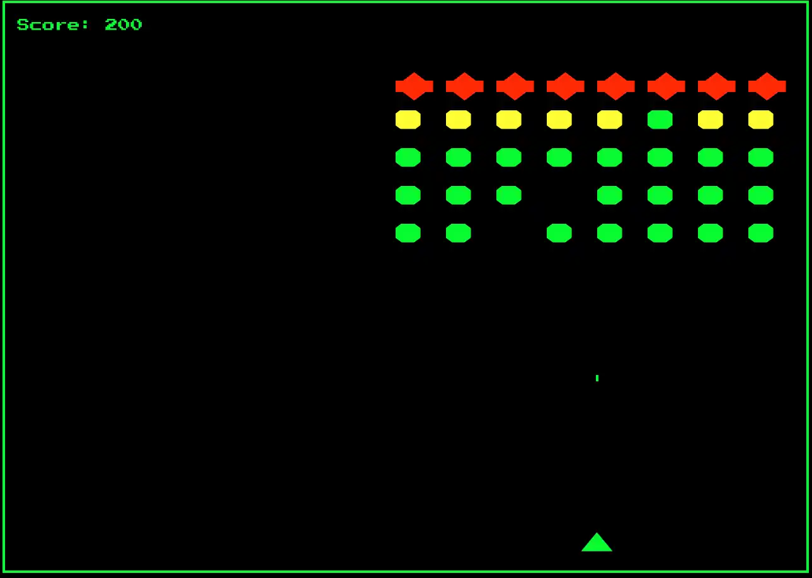

## 👾 Space Invaders Replica

<p align = "center">
    
</p>

  --> [**Try it out!**](https://spacex-invaders.vercel.app/)

## 〔ℹ〕 About
This project is a **simple replica** of the classic video game Space Invaders developed using **Vue 3, TypeScript, and Vite**.
The purpose of this project is to showcase the knowledge acquired in web development.


## Características

- **Developed with Vue 3 and TypeScript**: Vue 3 with `<script setup>` syntax and TypeScript are used for a modern, safe, and efficient development experience.
- **Vite as Bundler**: Vite is used as the bundler for this project, providing a fast and optimized development experience.
- **Classic Game**: Based on the classic *Space Invaders*, the player must destroy the space invaders before they reach the bottom of the screen.
- **Interactivity**: The player can move their spaceship and shoot to destroy the invaders. Includes shooting power-ups, different enemies, collision detection…

## Requisitos

- **Node.js** (_version 16 or higher recommended_)
- **npm** | **yarn** | **pnpm** (_depending on your preferred package manager_)
- **Vite** (_global installation recommended for a better development experience_)

```bash
npm install -g vite
```


## Instalación

1. **Clone the repo**:

   ```bash
   git clone https://github.com/arielfalcon/spacex-invaders.git
   cd spacex-invaders-replica
   ```
2. **Install the dependencies**:

   ```bash
   npm install
   ```
3. **Launch the development server**:

   ```bash
    npm run dev
    ```
   > **Note**: The game is not yet optimized for mobile devices. For the best experience, use a desktop browser.
4. **Open [http://localhost:3000](http://localhost:3000) in your browser to view the result 🚀**
   > **Note**: Port may vary depending on your configuration.

